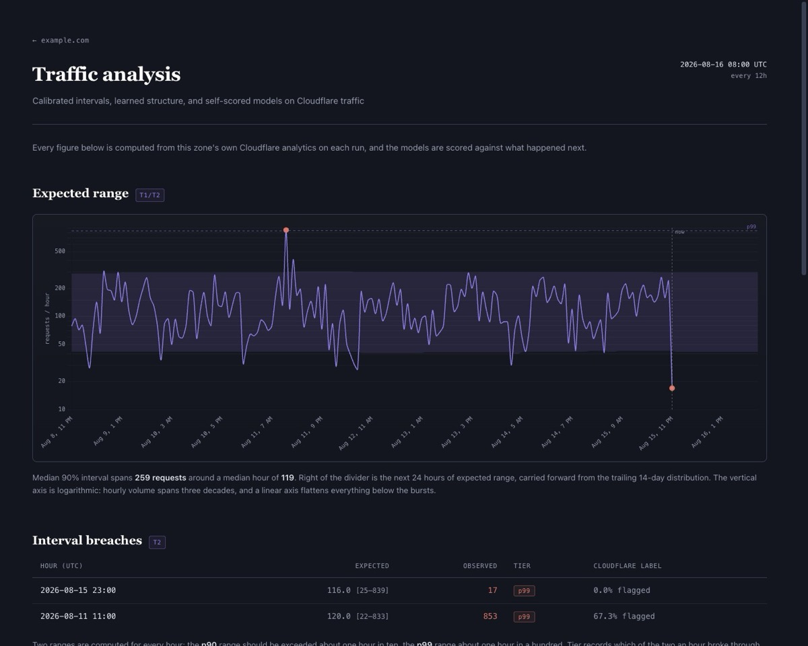

# ML Traffic Analysis

Measures a Cloudflare zone's own traffic and publishes a static dashboard: a
calibrated expectation interval, hours that broke it, behavioural clusters over
the addresses hitting you, and the model's own scored accuracy.

Point it at any Cloudflare-protected zone you control. It accumulates its own
history, so it works on the free plan, where retention is otherwise 24 hours.



*Rendered from `seed_demo_db.py` — synthetic traffic, so every figure above is
generated rather than anyone's real data. Run it yourself in three commands
below.*

## What it does

A scheduled pipeline that:

1. **Collects** traffic from Cloudflare's GraphQL API — hourly HTTP stats,
   firewall events, request patterns
2. **Stores** them in local SQLite, accumulating history the free plan does not
   retain
3. **Models** the traffic: a calibrated expectation interval, breaches measured
   against it, behavioral archetypes clustered from per-IP feature vectors, and
   the model's own scored accuracy
4. **Renders** a static dashboard — system fonts, Chart.js served from your own
   origin, nothing fetched from a third party at runtime
5. **Records** one row per run to `data/run_history.jsonl`, so calibration can be
   tracked across runs

### It does not forecast

The page states a calibrated range and then reports whether the calibration held.
It does not draw a forward prediction line.

Which estimator earns that range is decided per run, not assumed: `run_backtest()`
scores several candidates — rolling median, hour-of-day median, hour × day-of-week,
naive-previous — against held-out history and reports which won and by how much.
Whether your traffic has learnable structure is a question the tool answers about
your data, on every run.

## Try it without a Cloudflare account

```bash
pip install -r requirements.txt
python vendor_chartjs.py   # fetches Chart.js into lib/ (not committed)
python seed_demo_db.py     # synthetic traffic, RFC 5737 documentation IPs
python run.py dashboard
open output/index.html
```

The seeder is deterministic and generates everything it inserts — no sampled or
real traffic. Useful for evaluating the project, and it is what CI renders
against.

## Quick start (live data)

```bash
pip install -r requirements.txt
python vendor_chartjs.py

# Cloudflare credentials — env vars, or files in the project root
export CF_API_TOKEN="your-cloudflare-api-token"
export CF_ZONE_ID="your-cloudflare-zone-id"

# Dashboard identity (optional — defaults to example.com)
export DASHBOARD_SITE_URL="https://your-domain.com"
export DASHBOARD_SITE_NAME="your-domain.com"

# Optional: addresses to exclude from entity clustering, comma-separated.
# Usually your own — an operator browsing their own site accumulates enough
# hits to rank as a top entity and crowd out a real one.
export ML_EXCLUDED_IPS="203.0.113.7"

python run.py              # collect → analyse → render
python run.py collect      # Cloudflare pull only
python run.py analyze      # models + render
python run.py dashboard    # re-render from stored data
python run.py verify       # check the API token works
```

Output lands in `output/` — `index.html`, `dashboard.css`, `dashboard.js` and
`lib/`. It is entirely static: copy the whole directory to wherever you serve it. Nothing is fetched from a third-party origin at runtime, so it
works behind whatever headers or hosting you already use.

### Getting the credentials

**Zone ID**: Cloudflare dashboard → select the domain → Overview → right-hand
sidebar, under API.

**API token**: My Profile → API Tokens → Create Token → Custom token. It needs
read access to zone analytics — the three GraphQL datasets used are
`httpRequests1hGroups`, `httpRequestsAdaptiveGroups`, and `firewallEventsAdaptive`.
Grant **Zone → Analytics → Read**, and **Zone → Firewall Services → Read** if
your token template lists it separately. Nothing here writes, so no write scope
is needed. `python run.py verify` checks the token before you schedule anything.

### What a new deployment looks like

The pipeline builds its own history, so it is not useful immediately:

| Collected | What you get |
|---|---|
| < ~50 hours | Interval unavailable; the page renders and says so |
| ~50 hours (≈2 days) | Expectation interval and breaches appear |
| ~100 hours (≈4 days) | Calibration scoring and backtest become meaningful |
| 14 days | Full quantile window — the interval is properly calibrated |

That is a property of the free plan, not the code: Cloudflare retains firewall
events for 24 hours, so history has to be accumulated rather than backfilled. If
you want to see the finished shape immediately, run `seed_demo_db.py` instead.

## GitHub Actions

`.github/workflows/collect.yml` — **manual dispatch only. There is no schedule.**

That is deliberate. This repository is a reference implementation, not a running
deployment, and a cron trigger would fire on every fork whether or not anyone had
configured a zone — burning Actions minutes to collect nothing. Nothing here runs
until you press the button or add a schedule yourself.

To run it on a schedule against your own zone, set the secrets below, then
uncomment the `schedule:` block at the top of the workflow and match
`SLOT_HOURS` in `config.py` to the interval you pick.

**Secrets** (Settings → Secrets and variables → Actions):

| Name | Purpose |
|---|---|
| `CF_API_TOKEN` | Cloudflare API token (Analytics + Firewall read) |
| `CF_ZONE_ID` | Zone ID for the domain you monitor |

**Variables** (Settings → Variables), all optional:

| Name | Example | Purpose |
|---|---|---|
| `DASHBOARD_SITE_URL` | `https://your-domain.com` | Canonical origin in generated HTML |
| `DASHBOARD_SITE_NAME` | `your-domain.com` | Label in titles and headers |
| `ML_EXCLUDED_IPS` | `203.0.113.7` | Addresses to skip when clustering |
| `ML_SLOT_HOURS` | `12` | Hours between runs, as stated on the page. Match it to your schedule — nothing detects it drifting |

`ML_DB_SOURCE` is set by the workflow itself, not by you. It records whether the
run started from a restored cache or an empty database, so a silent cache
eviction — which resets every longitudinal series on the page — is visible in
the data rather than looking like a real change in the traffic.

Without credentials the workflow still runs, says so in the job log, and skips
the history commit rather than failing — a fork should not show a red Actions
tab merely for being unconfigured.

The workflow caches `data/traffic.db` between runs and commits `data/run_history.jsonl`
to a `run-history` branch, kept off `main` so machine commits do not bury real
ones or retrigger workflows. If you do add a schedule, that commit is also what
keeps the repository active enough that GitHub does not auto-disable it after 60
days of inactivity.

Deploy `output/` yourself — FTP, GitHub Pages, S3. Commented options are in the
workflow.

## How the models work

**Expectation interval.** Rolling quantiles over a 14-day trailing window of
*observed* hours, at two tiers (p90 and p99). Missing hours are skipped rather
than zero-filled — imputing zero for a collection gap drags the lower bound down
and manufactures breaches that never happened.

**Breaches.** Hours outside the p99 band, reported with what was expected, what
arrived, and how much of it Cloudflare had already flagged.

**Calibration.** The interval claims 90% and 99% coverage; the page measures what
it actually achieved and prints both. A model that claims 90 and delivers 88.3 is
reported as such rather than quietly rounded.

**Archetypes.** K-Means over per-IP feature vectors, k selected across 2–6 by
silhouette with a margin so it does not chase noise. Clusters smaller than the
floor are pulled out and named individually instead of dressed up as a group.

**Backtest.** Replays the interval against held-out history and scores it.

## Build-time gates

The page runs unattended, so two checks run against the assembled HTML and fail
the build rather than publishing something wrong:

- **`number_provenance`** — every number in a caption must trace to a value the
  run actually computed. A figure that was correct when it was typed and is now
  frozen looks exactly like a live one; this is what tells them apart.
- **`chart_table`** — the chart series and the rendered table must agree about
  the same hours, so a chart cannot silently stop matching the numbers beside it.

The page reports measurements and the models' scores against them. It draws no
conclusions about what the traffic means — the captions describe method, not
findings.

## Privacy

Exemplar addresses are masked before rendering — the final octet (or IPv6 group)
is dropped. IP addresses are personal data under GDPR, and an archetype is just
as concrete with a masked address. If you publish a dashboard, this is what
keeps an individual visitor from being identifiable in it.

## Cloudflare free plan limits

- Firewall events are **sampled** and cover only the **last 24 hours**
- No bot score (Business+)
- No raw logs (Enterprise)
- Hourly aggregates retain longer

This is why the pipeline collects on a schedule and accumulates its own history.

## Project structure

```
├── run.py                 # entry point
├── collector.py           # Cloudflare GraphQL collection
├── storage.py             # SQLite schema and helpers
├── config.py              # credentials and dashboard identity
├── seed_demo_db.py        # synthetic data, for trying it without a zone
│
├── pipeline_v2.py         # orchestration: models → render
├── predictive.py          # interval, calibration, backtest, archetypes
├── provenance.py          # build-time number-provenance gate
├── run_clock.py           # single run timestamp
├── dashboard_v2.py        # Jinja2 HTML/CSS/JS renderer
│
├── chart-loader.js        # loads Chart.js from lib/, no inline script
├── vendor_chartjs.py      # fetches Chart.js into lib/
├── lib/                   # gitignored — Chart.js lands here
└── data/
    ├── traffic.db         # gitignored — accumulated traffic
    └── run_history.jsonl  # committed empty — per-run metrics
```

## Development

Check a change without a Cloudflare zone:

```bash
python seed_demo_db.py --force   # synthetic data
python run.py dashboard          # renders into output/
```

CI runs the same path on every pull request: syntax check, import-graph
resolution, a render against the seeded database, and an assertion that the
rendered page takes its identity from config rather than a hardcoded literal.

`main` is branch-protected; use feature branches and pull requests. See
[CONTRIBUTING.md](CONTRIBUTING.md).

A pre-commit hook refuses staged credentials and site identity:

```bash
git config core.hooksPath .githooks
```

It blocks credential-shaped filenames and contents out of the box. The identity
check — domains, author names, origin IPs — ships with **no patterns**, because
this is a public repository and a denylist committed here would publish the very
strings it is meant to protect. Supply your own in `.identity-denylist` (project
root, gitignored, one extended-regex per line):

```
your-domain\.com
Your Name
203\.0\.113\.7
```

Without that file the identity check is inert; the credential checks still run.

## License

BSD 3-Clause — see [LICENSE](LICENSE). Use, modify, and redistribute freely,
including commercially, provided the copyright notice is retained. The third
clause means the author's name may not be used to endorse or promote derived
works without permission.

Chart.js is fetched into `lib/` by `vendor_chartjs.py` rather than committed here,
and carries its own MIT licence, preserved in the file header. Upstream:
https://github.com/chartjs/Chart.js
